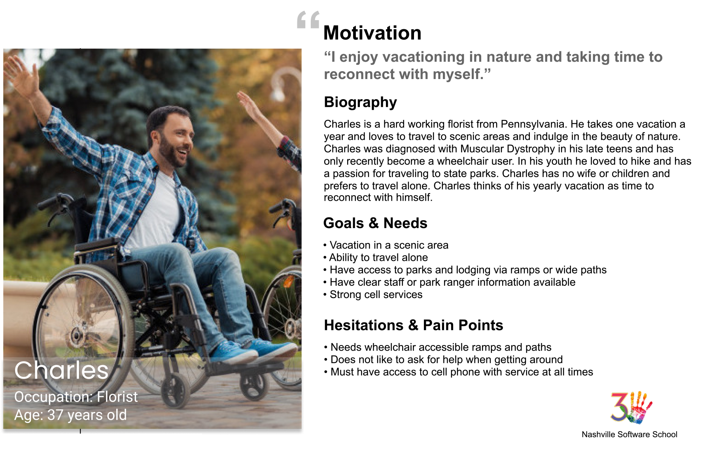

# Welcome to Isle Royale

Our group was given the assignment to design an application to help plan a trip to one of the many National Parks of the United States of America using the National Parks API, as well as 2 APIs provided by Nasvhille Software School which list various Famous Eateries and Bizarre Attractions which the user may also browse and save to an itinerary to include 1 Park selection, 1 Eatery selection, and 1 Bizarre Attraction selection which can be saved and listed on the right side of the page. 

The Isle Royale team chose to tailor this app to a fictitious user persona named "Charles" who is seaking destintations with senic views, and wheelchair-accessability. We started off by filtering our API request to only display National Parks which inluded the word "scenic" in their descriptions, as well as to only display Eateries with Handicap Accessability.

## Charles

This page requires the use of a local JSON server to host the stored list of saved itineraries.

## Goals for this project

One of our main learning goals for this project was to practice building and implementing JavaScript modules which minimized coupling and adhered as close to the Single Responsibility Principle as possible.

Furthermore, we wanted to gain experiencing fetching, rendering, and storing information for multiple APIs on the same page, and making dynamic fetch calls based on user interaction with the webpage. We achieved this by utilizing an Event Hub to coordinate functions on the webpage. 

## National Park Service API

* API home: https://www.nps.gov/subjects/digital/nps-data-api.htm
* API documentation: https://www.nps.gov/subjects/developer/api-documentation.htm

## Weather API

https://openweathermap.org/api

## Bizarre Destination

http://holidayroad.nss.team/bizarreries

## Eateries Destination

http://holidayroad.nss.team/eateries

## Feature List

### Building the Itinerary

* All "scenic" National Parks are listed in a dropdown. When user chooses one, the name and a photograph of the park are displayed in the **Itinerary Preview** section.

* All Bizarrare Attractions are listed in a dropdown. When user chooses one, the name and location of the bizarre attraction is displayed in the **Itinerary Preview** section.

* All handicap-accessable Eateries are listed in a dropdown. When user chooses one, display the name and location of the eatery is displayed in the **Itinerary Preview** section.

### Itinerary Details

* In the **Itinerary Preview** section, there is a button labeled _Save Itinerary_. It is disabled by default.

* When the user has selects a park, and the name of the park has is added to the **Itinerary Preview** section. We then query the Open Weather API and display the 5 day forecast for that location. As an added feature, the local weather for the fictitious user's home town of Nashville, TN is displayed by default upon page load, pulled from the same API.

* When the user adds an item to the **Itinerary Preview**, there is a _Details_ button on the card that can be clicked.

* When the user clicks on any detail button for an itinerary item, the card expands to display the rest of the detail text. The user can then choose to hide the infromation again by clicking the _Minimize_ button.

* Once the user has selected a park, a bizarre attraction, and an eatery, the _Save Itinerary_ button will be enabled.

* When the user clicks the _Save Itinerary_ button, the chosen items are saved as an object in your own, local API managed by `json-server`. Each saved itinerary appears in an aside bar on the right side of the UI and includes the image and coordinates for the Park as well as the names and locations of the Attraction and Eatery.

